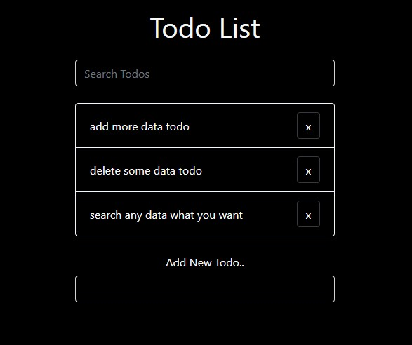

# Document Object Model with JS

membuat html statik menjadi interaktif menggunakan DOM Javascript

> [JS Dokumentasi](https://developer.mozilla.org/en-US/docs/Web/JavaScript/Reference)

> [Bootstrap CSS](https://getbootstrap.com/)

## Play With Todos App

Berikut ini adalah salah satu contoh penerapan javascript dasar dalam pembuatan aplikasi sederhana, masih banyak metode lain yang mungkin lebih efektif.



#### Langkah Awal

- inisialisasi komponen yang memiliki `class` yang ada di HTML kedalam file js menggunakan `document.querySelector()`

```javascript
const addForm = document.querySelector(".add");
const list = document.querySelector(".lists");
const search = document.querySelector(".search input");
```

#### Menambahkan Data Baaru dan Mengapus

- membuat fungsi tambahan dari javascript ke html kita

```javascript
// generate js func into html
const generate = (param) => {
  const html = `
        <li
          class="list-group-item d-flex justify-content-between align-items-center"
        >
          <span>${param}</span>
          <button class="delete btn btn-small btn-dark">x</button>
        </li>
    `;
  list.innerHTML += html;
};
```

- berikut adalah fungsi menambahkan data baru sesuai inputan dari form yang telah kita buat
- fungsi yang menghapus data yang ada didalam list kita

```javascript
// add todo list
addForm.addEventListener("submit", (e) => {
  e.preventDefault();
  const newTodo = addForm.add.value.trim();
  console.log(newTodo);
  if (newTodo.length) {
    // parse the generate func into newTodo
    generate(newTodo);
    addForm.reset();
  }
});

// remove todo
list.addEventListener("click", (e) => {
  if (e.target.classList.contains("delete")) {
    e.target.parentElement.remove();
  }
});
```

#### Fitur Search sederhana

- Buat fungsi filter data didalam list
  Disini menggunakan `Array.from(list.children)` untuk membungkus data list kedalam array dan menggunakan method `filter().includes()`

```javascript
// filter func
const filteredData = (param) => {
  // get childern of lists
  let newData = Array.from(list.children).filter(
    (data) => !data.textContent.toLowerCase().includes(param)
  );
  //   console.log(newData);
  newData.length > null
    ? newData.forEach((data) => data.classList.add("filtered"))
    : newData.forEach((data) => data.classList.remove("filtered"));
};
```

- Fungsi search data yang sangat sederhana

```javascript
// search todo
search.addEventListener("keyup", (e) => {
  e.preventDefault();
  const typing = search.value.trim();
  //   console.log(term);
  filteredData(typing);
});
```

> Ini sebagian kecil bagaimana javascript berperan dalam memanipulasi data HTML agar lebih interaktif.
